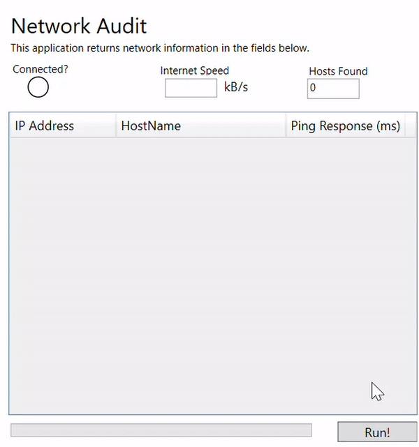

# Network-Audit
This application performs an asynchronous IP ping sweep and returns network information using C#/WPF and the System.Net Dns class. 

First, a network connection is confirmed and internet speed determined, then the table is populated with devices found on the network.

### NetworkerViewModel.cs
This file contains the ViewModel for the application, and consists of two classes:

##### LocalMachineViewModel
This class contains information for the local machine such as the local IP address, if a network is available, and internet speed.

#### NetworkerViewModel
This class contains information for any remote device on the same network as the local machine. It will have its own remote IP address,
and we will test if the device is on the network (with asynchronous pings), and obtain its hostname if so.

### NetworkerModel.cs
The view for the application; this first instantiates an object for the LocalMachineViewModel class, and then asynchronously iterates through 
all IP addresses on its subnet to identify if the device is actually on the network.

